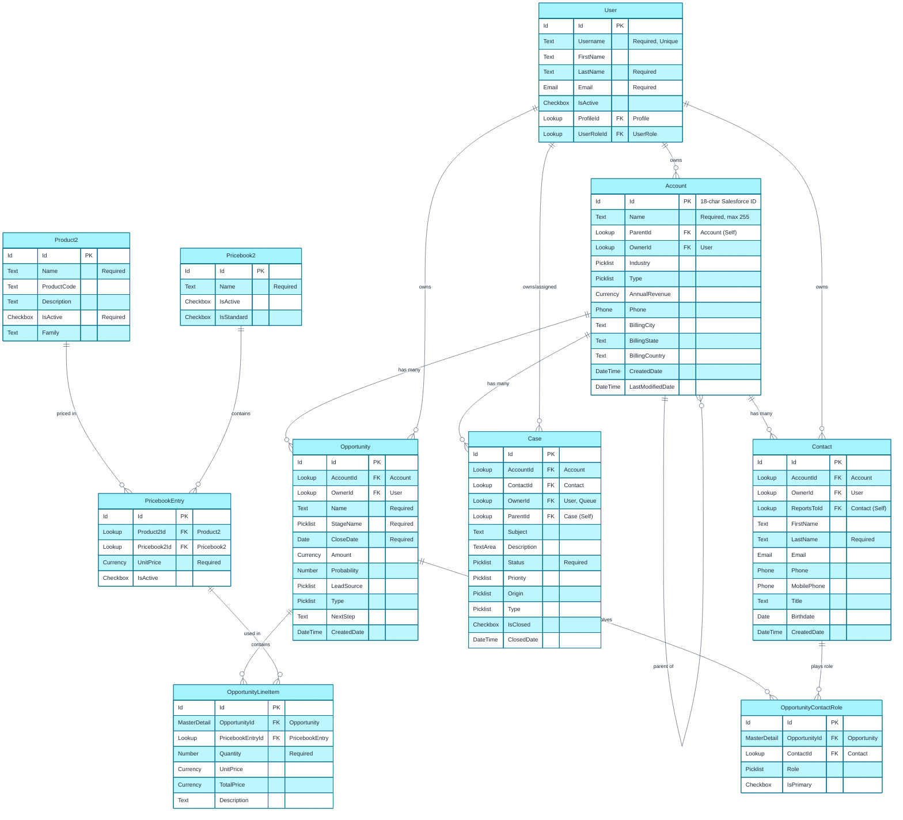

# Salesforce ERD Template

Entity Relationship Diagram template for visualizing Salesforce data models.

## When to Use
- Documenting object relationships
- Planning data model changes
- Understanding existing schema
- Design reviews and architecture discussions

## sf-metadata Integration

When connected to an org, query object definitions:

```
Skill(skill="sf-metadata")
Request: "Describe objects: Account, Contact, Opportunity, Case"
```

This returns:
- Field names and types
- Lookup/Master-Detail relationships
- Required fields
- External IDs

## Mermaid Template - Standard Sales Cloud



## ASCII Fallback Template

```
┌─────────────────────────────┐
│          ACCOUNT            │
├─────────────────────────────┤
│ Id (PK)                     │
│ Name (Required)             │
│ ParentId (FK → Account)     │──────────────────┐
│ OwnerId (FK → User)         │                  │
│ Industry                    │                  │
│ Type                        │                  │
│ AnnualRevenue               │                  │
└─────────────┬───────────────┘                  │
              │                                   │
              │ 1:N                               │
              ▼                                   │
┌─────────────────────────────┐                  │
│          CONTACT            │                  │
├─────────────────────────────┤                  │
│ Id (PK)                     │                  │
│ AccountId (FK → Account) ───│──────────────────┘
│ OwnerId (FK → User)         │
│ ReportsToId (FK → Contact)  │───┐
│ FirstName                   │   │
│ LastName (Required)         │   │ Self-reference
│ Email                       │<──┘
│ Phone                       │
└─────────────────────────────┘

              │
              │ N:M (via junction)
              ▼

┌─────────────────────────────┐     ┌─────────────────────────────┐
│  OPPORTUNITY_CONTACT_ROLE   │     │        OPPORTUNITY          │
├─────────────────────────────┤     ├─────────────────────────────┤
│ Id (PK)                     │     │ Id (PK)                     │
│ OpportunityId (FK) ─────────│────>│ AccountId (FK → Account)    │
│ ContactId (FK → Contact)    │     │ OwnerId (FK → User)         │
│ Role                        │     │ Name (Required)             │
│ IsPrimary                   │     │ StageName (Required)        │
└─────────────────────────────┘     │ CloseDate (Required)        │
                                    │ Amount                      │
                                    └─────────────┬───────────────┘
                                                  │
                                                  │ 1:N
                                                  ▼
                                    ┌─────────────────────────────┐
                                    │    OPPORTUNITY_LINE_ITEM    │
                                    ├─────────────────────────────┤
                                    │ Id (PK)                     │
                                    │ OpportunityId (FK)          │
                                    │ PricebookEntryId (FK)       │
                                    │ Quantity (Required)         │
                                    │ UnitPrice                   │
                                    │ TotalPrice                  │
                                    └─────────────────────────────┘
```

## Cardinality Notation

| Symbol | Meaning | Salesforce Equivalent |
|--------|---------|----------------------|
| `\|\|` | Exactly one | Required Lookup |
| `\|o` | Zero or one | Optional Lookup |
| `o{` | Zero or many | Child objects |
| `\|{` | One or many | Required children |

## Relationship Types


## Salesforce Field Type Mapping

| Salesforce Type | ERD Type | Example |
|-----------------|----------|---------|
| Id | Id | `Id Id PK` |
| Text | Text | `Text Name` |
| Text Area | TextArea | `TextArea Description` |
| Number | Number | `Number Quantity` |
| Currency | Currency | `Currency Amount` |
| Percent | Percent | `Percent Probability` |
| Checkbox | Checkbox | `Checkbox IsActive` |
| Date | Date | `Date CloseDate` |
| DateTime | DateTime | `DateTime CreatedDate` |
| Picklist | Picklist | `Picklist Status` |
| Multi-Picklist | MultiPicklist | `MultiPicklist Industries` |
| Email | Email | `Email Email` |
| Phone | Phone | `Phone Phone` |
| URL | URL | `URL Website` |
| Lookup | Lookup | `Lookup AccountId FK "Account"` |
| Master-Detail | MasterDetail | `MasterDetail AccountId FK "Account"` |
| Formula | Formula | `Formula FullName` |
| Roll-Up Summary | RollUp | `RollUp TotalAmount` |

## Custom Object Example


## Best Practices

1. **Use API Names** - Show `Account__c` not "Custom Account"
2. **Mark Required Fields** - Add "Required" notation
3. **Show Relationship Type** - MD vs Lookup distinction matters
4. **Include Key Fields Only** - Don't overcrowd; focus on relationships
5. **Group Related Objects** - Use visual proximity

## Generating from sf-metadata

When sf-metadata returns object info, map to ERD:

```javascript
// Example mapping
{
  "name": "Account",
  "fields": [
    { "name": "Id", "type": "id" },
    { "name": "Name", "type": "string", "nillable": false },
    { "name": "ParentId", "type": "reference", "referenceTo": ["Account"] }
  ]
}

// Becomes:
// Account {
//     Id Id PK
//     Text Name "Required"
//     Lookup ParentId FK "Account"
// }
```

## Customization Points

- Add custom objects by following the pattern
- Include only relevant fields (not all 200+ standard fields)
- Use comments `%% Comment` for notes
- Adjust layout by reordering entities
